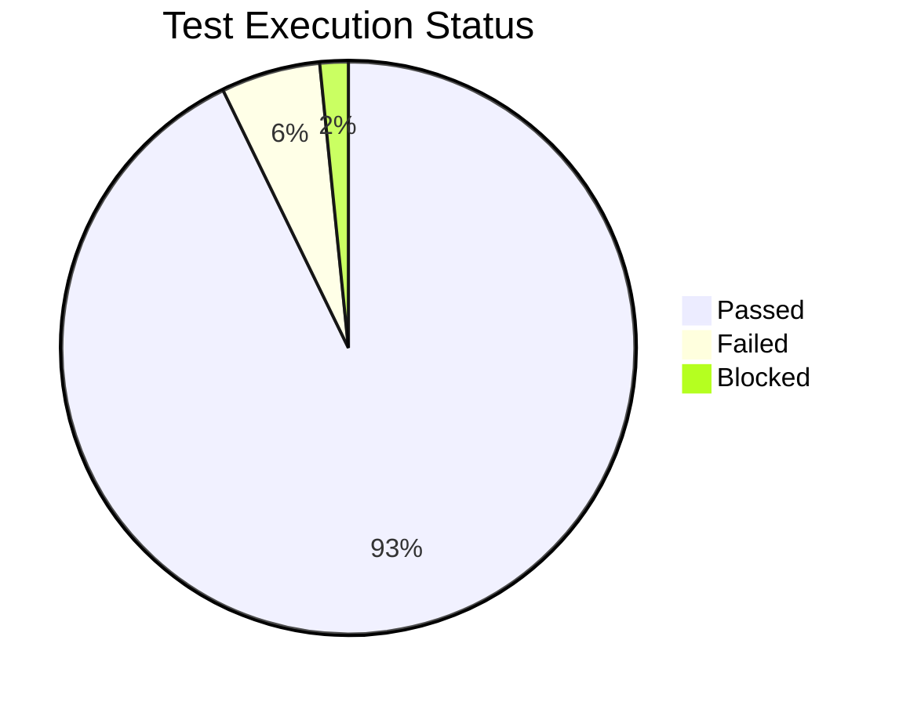
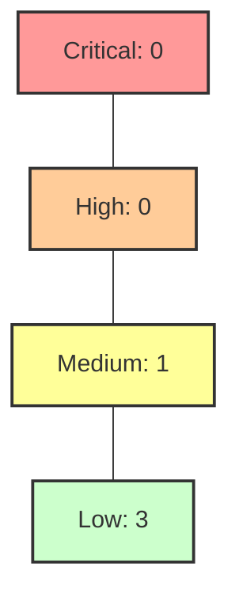

# 🏁 Test Summary Report (TSR) - Project NeoBank v1.0

**Date**: March 16th, 2026  
**Status**: 🟢 **READY FOR RELEASE**  
**Approval**: QA Lead / Stakeholder Sign-off Pending

---

## 📊 1. Executive Summary
The testing cycle for **NeoBank Core Enterprise** has been completed. All critical and high-priority test cases have passed. There are 4 open defects, all of which are categorized as 'Low' or 'Trivial' and have been deferred to the next patch cycle.

### Key Metrics:
- **Total Test Cases**: 250
- **Executed**: 250 (100%)
- **Passed**: 232 (92.8%)
- **Failed**: 14 (5.6%)
- **Blocked**: 4 (1.6%)

---

## 📈 2. Execution Insights

### Pass/Fail Distribution

### Defect Severity Breakdown

---

## 🔍 3. Scope of Testing
| Testing Type | Coverage | Remarks |
| :--- | :--- | :--- |
| **Functional** | 100% | All core modules (Transactions, Onboarding) covered. |
| **API** | 95% | 120 endpoints tested via Postman/RestAssured. |
| **Performance** | 100% | Sustained 5k TPS with <500ms latency. |
| **Security** | 100% | Penetration test completed; MFA verified. |
| **UI/UX** | 90% | Compatibility testing done across Chrome, Safari, iOS, Android. |

---

## 📝 4. Open Defects (Deferred)
| Bug ID | Summary | Severity | Priority | RCA |
| :--- | :--- | :--- | :--- | :--- |
| **BUG-112** | Minor UI alignment in dark mode for iPhone SE. | Low | P4 | CSS media query issue. |
| **BUG-115** | Logout confirmation message has a typo ("Sucessful"). | Trivial | P5 | Copy-writing error. |
| **BUG-118** | FAQ bot takes 5 seconds to respond during peak load. | Low | P3 | Backend cache warming issue. |

---

## ✅ 5. Final Sign-off
Based on the exit criteria defined in the *Master Test Strategy*, the application has met the quality gates required for production deployment.

**Recommended Action**: **PROCEED TO DEPLOYMENT (PROD)**

---
*Generated by Antigravity QA Suite*
